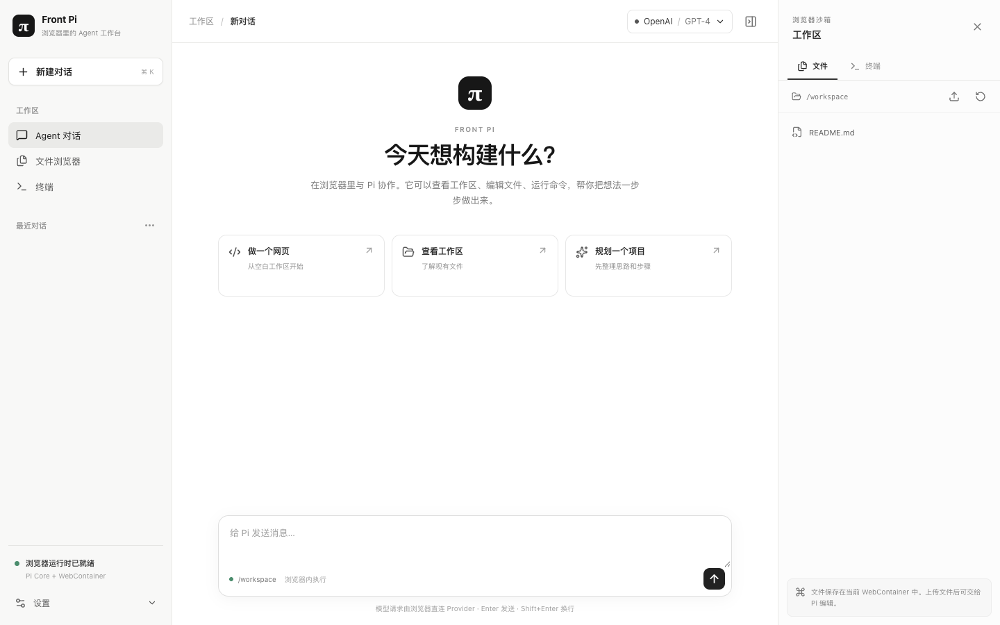

# Front Pi

**在浏览器里运行 Pi Agent 的轻量工作台。** 打开页面、接入自己的模型服务商，就能让 Agent 在隔离工作区中读取文件、修改代码和执行命令。界面采用浅色三栏布局，适合一边对话一边查看文件与终端。



> 当前项目使用 **Pi Agent Core**，并非完整的 Pi Coding Agent CLI。模型请求由用户浏览器直接发送到服务商；静态站点服务器不运行 Agent，也不保存 API Key。

## 已实现

- **对话与 Agent Loop**：流式回复、工具调用、停止生成、多轮会话。
- **浏览器工作区**：通过 WebContainer 提供隔离的 `/workspace`，支持 `list_files`、`read_file`、`write_file`、`edit_file` 和 `run_command`。
- **服务商设置**：内置 OpenAI、Anthropic、Google Gemini、OpenRouter、DeepSeek、xAI、Mistral 和 Groq 的 Pi 模型目录；可保存 API Key、选择模型并发起连接测试。
- **上下文管理**：接近模型上下文预算时自动摘要较早消息，保留完整的页面会话记录。
- **本地恢复**：对话存于 localStorage，工作区文件快照存于 IndexedDB；刷新页面后可以继续使用。

## 快速开始

需要 Node.js **20.19+ 或 22.12+**、npm，以及支持 WebContainer 的桌面 Chromium 浏览器（推荐 Chrome 或 Edge）。

```bash
git clone https://github.com/YinsenWANG/front-pi.git
cd front-pi
npm ci
npm run dev
```

打开 <http://127.0.0.1:5173/>，等待左下角显示“浏览器运行时已就绪”。点击右上角模型按钮：

1. 选择服务商，填入自己的 API Key 并保存。
2. 选择模型，点击“测试连接”。
3. 关闭设置，在输入框中开始对话。

首次启动 WebContainer 可能需要一点时间。**开发服务器需要持续运行**；如果关闭终端或重启 Vite，请重新打开页面。

## 它运行在哪里？

| 部分 | 运行位置 |
| --- | --- |
| UI、Pi Agent Core、Agent Loop、上下文摘要逻辑 | 用户浏览器 |
| 文件和命令工具 | 用户浏览器内的 WebContainer |
| 模型推理 | 所选服务商的服务器 |
| 静态网页文件 | 部署 Front Pi 的网站服务器 |
| API Key | 当前标签页的 sessionStorage |
| 对话 / 工作区快照 | 当前浏览器的 localStorage / IndexedDB |

每个浏览器标签页有自己的 Agent 运行状态。浏览器存储不提供跨设备同步；早期版本使用的 `pi-browser:` 存储键继续保留，以免重命名后丢失已有数据。工作区无法直接读取用户电脑上的文件，需要先通过页面上传。

### 服务商直连的限制

浏览器会直接向模型 API 发请求，因此服务商必须允许来自站点来源的 CORS 请求。**连接测试通过，说明当前 Key、模型、网络和 CORS 组合可完成一次基本文本请求。** 未使用真实 API Key 逐一验证全部八家服务商。若服务商不支持浏览器直连，需要自行部署可信的请求网关；不要将共享的服务端密钥写进前端代码。

## 部署

```bash
npm run build
```

把 `dist/` 交给静态网站服务器托管。生产环境需要 HTTPS，并在页面响应上设置跨源隔离响应头：

```text
Cross-Origin-Opener-Policy: same-origin
Cross-Origin-Embedder-Policy: credentialless
```

WebContainer 依赖 SharedArrayBuffer 和跨源隔离；部署后可在浏览器控制台检查 `crossOriginIsolated === true`。Vite 开发与预览服务器已在 [vite.config.ts](vite.config.ts) 中设置这些响应头；自行托管 `dist/` 时也必须配置。WebContainer 的浏览器支持和商业使用条件请查看其[官方文档](https://webcontainers.io/guides/browser-support)及[授权页面](https://webcontainers.io/enterprise)。

## 当前边界

- 这套实现集成的是 `@earendil-works/pi-agent-core` 和 `@earendil-works/pi-ai`。Pi Coding Agent CLI 的扩展、skills、TUI、OAuth、会话树和原生图片流程尚未接入。
- 上下文摘要会尽量保留最近对话；若当前单轮消息过长或摘要失败，页面会提示，但模型请求仍可能因超出窗口而失败。
- 文件快照不包括 `node_modules` 和 `.git`；工具输出及读取的大文件有长度限制。
- API Key 保存在当前标签页的 sessionStorage，不会由本项目上传到自己的后端；它仍会从浏览器发送给所选模型服务商。

曾尝试在 WebContainer 内安装完整 Pi CLI：安装成功，但 `pi --version` 因缺少 `@earendil-works/chord` 而失败。探针见 [scripts/full-cli-probe.mjs](scripts/full-cli-probe.mjs)。

## 开发与验证

```bash
npm run build
node --experimental-strip-types scripts/context-smoke.mjs
```

下面的浏览器烟测需要先运行 `npm run dev`，并在本机安装 Chrome：

| 命令 | 检查内容 |
| --- | --- |
| `node scripts/smoke.mjs` | 页面、WebContainer 终端、工作区刷新恢复 |
| `node scripts/agent-smoke.mjs` | 模拟服务商响应，测试连接、对话、工具循环 |
| `node scripts/context-browser-smoke.mjs` | 长会话摘要与摘要边界持久化 |
| `node scripts/module-recovery-smoke.mjs` | 模拟 Vite 依赖模块返回 504 后的恢复 |
| `node scripts/ui-review.mjs` | 桌面设置页与移动端布局截图 |

这些测试使用模拟服务商响应，不证明真实 API Key、额度或 CORS 一定可用。若本地页面在 Vite 重启后出现 `Failed to fetch dynamically imported module`，先确认开发服务器仍在运行，再刷新页面；应用也会在服务可达时自动尝试刷新一次。

## 致谢与许可

- [Pi Agent Core](https://github.com/earendil-works/pi/blob/main/packages/agent/README.md) 提供 Agent、事件流与工具循环；[Pi AI](https://github.com/earendil-works/pi/tree/main/packages/ai) 提供模型与服务商接口。
- [WebContainer](https://webcontainers.io/guides/quickstart) 提供浏览器内的 Node.js 工作区。
- 交互结构参考了 [Hermes Web UI](https://github.com/ifsherlock/hermes-web-ui)；Front Pi 未复制其前端代码。

Front Pi 的项目代码采用 [Apache License 2.0](LICENSE)。依赖项遵循各自的许可证。
